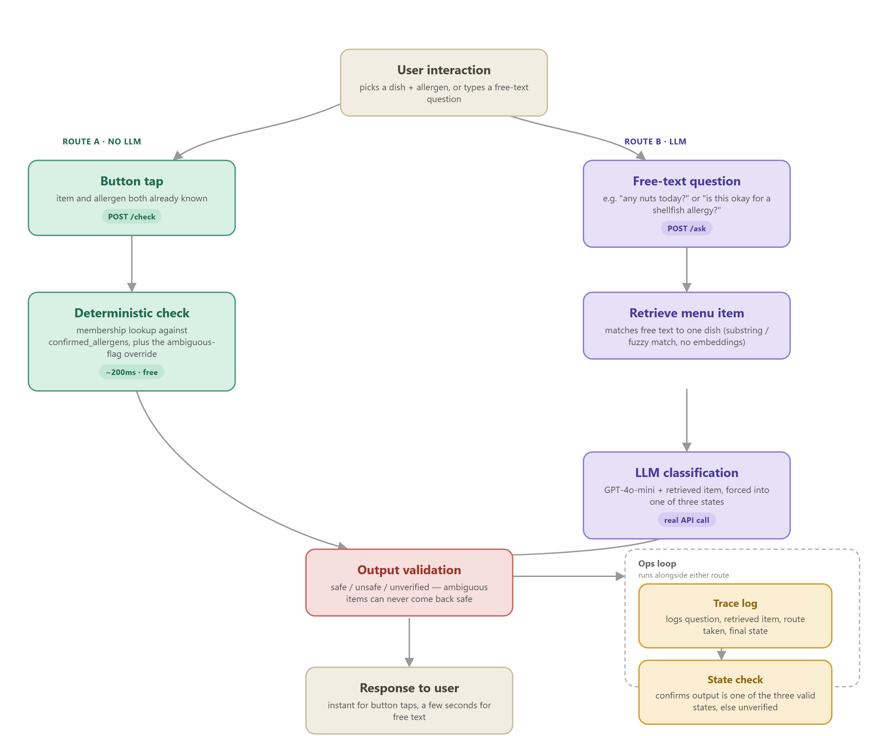
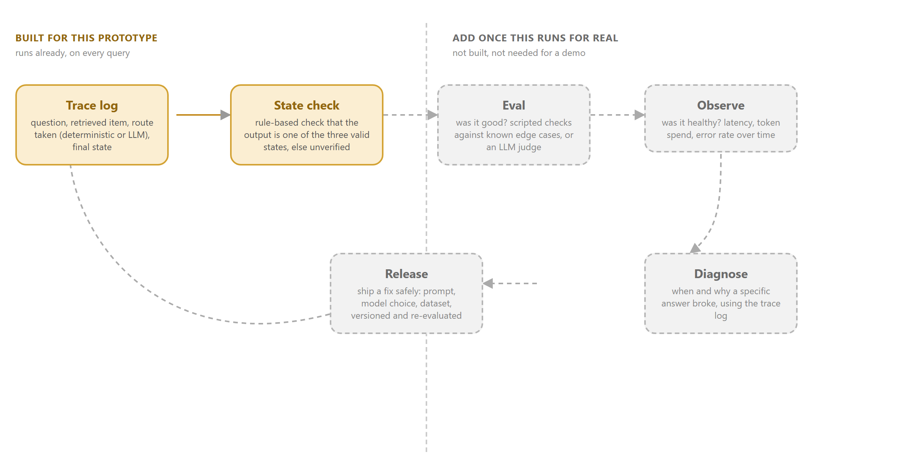

# Can I Eat This?

A quick allergen check for a dining hall counter, built for Compass Group's AI Engineer pre-work brief. You pick a dish and an allergen, or scan a counter QR code, and get one of three grounded answers back: safe, unsafe, or ask staff. Nothing here guesses.


---

## Live

| | URL |
|---|---|
| **Frontend** | [frontend-rose-three-32.vercel.app](https://frontend-rose-three-32.vercel.app/) |
| **Backend API** | [can-i-eat-this-api.fly.dev/docs](https://can-i-eat-this-api.fly.dev/docs) |

The QR codes in `qr-codes/` point at the live frontend, so any one of them is scannable from a real phone right now.

The pitch deck for the interview is at [`slides/can-i-eat-this-pitch-deck.pdf`](slides/can-i-eat-this-pitch-deck.pdf), source in `slides/deck.html`.

---

## The scenario

It's 12:40 in a busy dining hall. Third in the queue. The person in front has a severe nut allergy. The menu is a laminated sheet, the allergen folder is behind the counter, and the server started on Monday. They have about thirty seconds to decide whether lunch is safe. This app is meant to answer that question in the time it takes to tap a screen twice, for the customer and for the server who doesn't know the menu yet either.

## What it does

Pick a dish, then pick an allergen:

```json
POST /check
{ "item": "Margherita pizza slice", "allergen": "milk" }

{
  "status": "unsafe",
  "item": "Margherita pizza slice",
  "explanation": "Margherita pizza slice is confirmed to contain milk.",
  "matched_allergens": ["milk"]
}
```

Or ask a free-text question that doesn't fit the two-tap flow:

```json
POST /ask
{ "question": "is this okay for a shellfish allergy?" }

{
  "status": "unverified",
  "item": "Moules marinière",
  "explanation": "Moules marinière is confirmed to contain molluscs.",
  "matched_allergens": ["molluscs"]
}
```

**Response fields:**
- `status` - always one of `safe`, `unsafe`, `unverified`, never a confidence score
- `item` - the menu item that was matched, if any
- `explanation` - one plain sentence, grounded in the actual menu data, not the model's own reasoning
- `matched_allergens` - which confirmed allergens triggered the result, empty for safe or unverified

`unverified` is not a fallback state bolted on for safety theatre. It's the answer whenever the underlying menu data is genuinely ambiguous ("may contain traces," "ask counter," a blank field) or missing entirely, and the system is built so that state can never be silently overridden into "safe."

---

## How it works

```
Button tap                              Free-text question
(item + allergen known)                 (e.g. "any nuts today?")
        |                                        |
        v                                        v
Deterministic check                     Retrieve menu item
(confirmed_allergens lookup)            (substring / fuzzy match, no embeddings)
        |                                        |
        |                                        v
        |                               GPT-4o-mini classification
        |                               (forced into one of three states)
        |                                        |
        +-------------------+-------------------+
                             |
                             v
                    Output validation
        (ambiguous menu data can never come back "safe")
                             |
                             v
                     Response to user
          (instant for taps, a few seconds for free text)
```



### Two routes, and the LLM only covers one of them

This is the decision worth defending hardest, so it's worth explaining properly.

`POST /check` takes an item and an allergen, both already known because they came from a button tap. Checking whether an allergen is on the confirmed list for that dish doesn't need language understanding, it's a lookup. So it is one, in `validate.py`. No LLM call, no network round trip to OpenAI, nothing to hallucinate, and it answers in well under a second.

`POST /ask` takes a free-text question. This is where GPT-4o-mini actually gets used, because turning "does this have anything a shellfish allergy would react to?" into "check the crustaceans and molluscs fields for this dish" is a real language problem that a keyword match handles badly.

`GET /allergen-check` reuses the same deterministic logic across the whole menu at once. That's what powers the counter view and the QR codes, so scanning a QR code never touches the LLM either.

The system started out routing everything through the LLM, including the button flow. It got pulled apart once it was obvious that most of the app didn't need AI at all, just correctly structured data. That's a stronger answer to "why does this need an LLM" than routing everything through one, since it shows the AI is scoped to the one part of the problem that actually needs it rather than being the default tool for everything.

### Why no vector database

The menu is 30 structured JSON records, not a large unstructured corpus. Matching a query to the right dish is an exact, small-scale problem that substring and fuzzy string matching solve for free, with no embedding pipeline, no external service, and no risk of returning the wrong dish with high confidence, which is what approximate nearest-neighbour search can do and a real problem for a system whose entire job is not guessing wrong. A vector database would earn its place if the catalogue grew to thousands of dishes across many sites, or if menus were being ingested from photos with no fixed structure. Neither is true here yet.

### The ops loop, today and later



Every query gets logged with the question, the retrieved item, which route it took, and the final state, and a rule-based check confirms the output is always one of the three valid states. That's genuinely useful and cheap to keep. What it deliberately skips is the full evaluate, observe, diagnose, release loop you'd want once this is a real production service handling menu changes and traffic at scale. Building that now would be solving a maintenance problem this prototype doesn't have yet.

---

## Tech stack

### Frontend
| Technology | Purpose |
|---|---|
| [Next.js 16](https://nextjs.org/) | App router, two-tap picker, free-text box, counter view |
| [React 19](https://react.dev/) | UI |
| [Tailwind CSS 4](https://tailwindcss.com/) | Styling, dark theme with a safe/unsafe/unverified colour system |
| [Vercel](https://vercel.com/) | Frontend hosting |

### Backend
| Technology | Purpose |
|---|---|
| [FastAPI](https://fastapi.tiangolo.com/) | `/menu`, `/check`, `/ask`, `/allergen-check` |
| [Uvicorn](https://www.uvicorn.org/) | ASGI server |
| [Pydantic v2](https://docs.pydantic.dev/) | Request/response schema, the three-state enum |
| [python-dotenv](https://pypi.org/project/python-dotenv/) | Local env loading |

### AI
| Technology | Purpose |
|---|---|
| [OpenAI GPT-4o-mini](https://platform.openai.com/docs/models) | Free-text question classification only, never the button-tap path |
| [qrcode](https://pypi.org/project/qrcode/) | Generates the counter QR codes |

### Infrastructure
| Technology | Purpose |
|---|---|
| [Docker](https://www.docker.com/) | Backend container image |
| [Fly.io](https://fly.io/) | Backend hosting, London region, API key set as a secret |
| [Vercel](https://vercel.com/) | Frontend hosting |
| [pytest](https://docs.pytest.org/) | Unit tests for the safety logic |

---

## Architecture

```
Browser (Vercel)
      |
      | HTTPS POST /check or /ask
      v
FastAPI Backend (Fly.io - London region)
      |
      |-- /check: deterministic dict lookup, no LLM call
      |-- /ask: GPT-4o-mini classification, forced into 3 states
      |-- /allergen-check: same deterministic logic across the whole menu
      |
      v
JSON response back to frontend
```

The frontend and backend are deployed independently. The Next.js app on Vercel calls the FastAPI backend on Fly.io directly from the browser. CORS is open on the backend since this is a public demo with synthetic data, not a system handling real personal information.

---

## API endpoints

| Method | Endpoint | Description |
|---|---|---|
| `GET` | `/menu` | Full menu as structured JSON |
| `POST` | `/check` | Deterministic item + allergen lookup, no LLM |
| `POST` | `/ask` | Free-text question, routed through GPT-4o-mini |
| `GET` | `/allergen-check` | Whole menu scanned against one allergen, sorted unsafe-first |

Full interactive documentation: [can-i-eat-this-api.fly.dev/docs](https://can-i-eat-this-api.fly.dev/docs)

---

## Running locally

**Requirements:** Python 3.11, Node.js 18+, an OpenAI API key

### Backend

```bash
git clone https://github.com/seyiabello/can-i-eat-this.git
cd can-i-eat-this

python -m venv .venv
.venv\Scripts\pip install -r requirements.txt
copy .env.example .env
```

Add your OpenAI API key to `.env`, then:

```bash
.venv\Scripts\python -m uvicorn main:app --host 127.0.0.1 --port 8000
```

Backend available at `http://localhost:8000`.

### Frontend

```bash
cd frontend
npm install
npm run dev
```

Frontend available at `http://localhost:3000`.

### Tests

```bash
.venv\Scripts\python -m pytest tests/ -v
```

Covers the ambiguous-item override (an item flagged ambiguous can never come back as safe, even if the model says otherwise), the deterministic lookup, and the fallback to unverified when the model output can't be parsed.

---

## Dataset

`data/menu.json` extends the brief's own ten-item starter menu to thirty. It keeps the original messiness on purpose (inconsistent capitalisation, "ask counter", a field that just says "null") and adds enough variety to cover celery, cereals with gluten, crustaceans, eggs, fish, lupin, milk, molluscs, mustard, tree nuts, peanuts, sesame, soya, and sulphites. One dish, the chicken satay skewers, has its allergen hidden in the sauce rather than the dish name on purpose, since that's a realistic way allergen information gets missed. Nuts and peanuts are kept as separate confirmed allergens throughout, matching how they're actually treated under EU allergen labelling, not merged into one "nuts" bucket.

---

## Deployment

Backend on Fly.io, frontend on Vercel, both on free tiers. The OpenAI key is set as a Fly secret, never baked into the image or committed anywhere, `.env` stays out of git entirely. A live public deployment wasn't required by the brief, a laptop demo would have been fine, but having a real URL means the QR codes actually work if anyone wants to scan one during the pitch.

```
can-i-eat-this/
├── main.py                    FastAPI app: /menu, /check, /ask, /allergen-check
├── models.py                  Pydantic schema, including the three-state enum
├── validate.py                deterministic and LLM-output validation logic
├── rag/
│   ├── retriever.py           matches free text to a menu item, no embeddings
│   └── generator.py           the one place an LLM gets called
├── data/
│   └── menu.json              30 synthetic dishes, all 14 EU allergens
├── frontend/
│   ├── app/                   two-tap picker, free-text box, counter view
│   └── lib/                   API client, shared allergen list
├── qr-codes/                  generated QR codes, one per allergen
├── scripts/
│   └── generate_qr_codes.py   regenerates QR codes against any base URL
├── assets/                    architecture diagrams, source HTML and PNG
├── tests/
│   └── test_validate.py       unit tests for the safety logic
├── PRODUCT.md                 who this is for, brand personality, anti-references
├── DESIGN.md                  the actual design system: colors, type, components, rules
├── Dockerfile
├── fly.toml
└── requirements.txt
```

### Design system

`PRODUCT.md` and `DESIGN.md` document the frontend's visual system properly rather than leaving it as implicit choices in the CSS. Worth calling out one concrete decision from that pass: the muted gray used for prices and captions was failing WCAG AA contrast (about 4.0:1 against the near-black background, the floor is 4.5:1), caught by actually checking the numbers rather than eyeballing it, and fixed. The unverified/amber result state is also a deliberate design decision, not an afterthought: it's styled with the exact same visual weight as safe and unsafe, since a "can't confirm" result being read as a lesser or broken answer would undermine the whole point of the three-state design.

---

## Roadmap

- [ ] Batch pipeline to turn a photo of a real laminated menu into structured entries, since hand-curating the dataset doesn't scale past a demo
- [ ] Basic auth and a proper admin view for updating menu data day to day
- [ ] The eval, observe, diagnose, release loop described above, once this is serving real traffic rather than a one-off demo

---

Built solo by [Seyi Bello](https://github.com/seyiabello) for Compass Group's AI Engineer pre-work brief.
